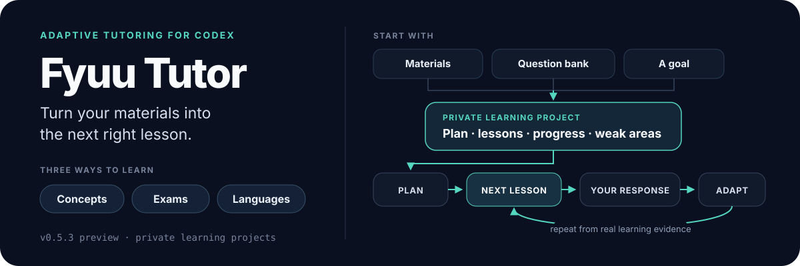

# Fyuu Tutor

[中文说明](README.zh-CN.md) · Current release: **v0.3.0 — Rich Learning Experiences**

<p align="center">
  
</p>

Give Codex a textbook, a question bank, or a learning goal. Fyuu Tutor plans the course, creates the next lesson, and continues from where you left off.

Fyuu Tutor is designed for learning that lasts weeks or months, not for answering a single question.

It keeps lessons, practice, progress, weak areas, and the next step in a private learning project. A new conversation, or even a different agent, can continue from the same recorded state.

## What it does

Start with a textbook, a few PDFs, a question bank, or simply something you want to learn.

Fyuu Tutor can:

- check whether source material was extracted correctly;
- identify the full learning scope before planning lessons;
- arrange topics around your current level;
- create browser-ready HTML lessons, practice, and reference notes;
- record what you studied and where you struggled;
- choose the next lesson from your actual responses.

A generated lesson is not treated as proof that you learned it. Fyuu Tutor keeps four things separate: the lesson exists, you studied it, you can use it independently, and you can still use it later or in a different situation.

## Three ways to use it

### Learn a concept or skill

Use it for AI agents, system design, data analysis, programming, or another practical capability.

Give it a topic, a set of articles, or a real project. It finds missing prerequisites, teaches through examples, and checks whether you can explain and apply the idea yourself.

```text
Use $fyuu-tutor to help me learn AI agents from these materials.
Check what I already know, then show me the course plan and first lesson.
```

### Prepare for an exam

Use it for PMP or another certification with a defined exam outline.

Fyuu Tutor maps the outline, study material, questions, and lessons together. It checks for missing coverage, records mistakes, and brings weak areas back in later lessons and review questions.

```text
Use $fyuu-tutor to create an exam-preparation project from this outline,
textbook, and question bank. Check the material and coverage before writing questions.
```

### Learn a language

Give it a textbook, dialogues, vocabulary, or situations you need at work.

It turns the material into contextual lessons and active speaking or writing practice. Recognizing an answer is not counted as being able to produce it.

```text
Use $fyuu-tutor to create a business-English speaking project from these dialogues.
Every lesson should include a real situation, active production, and review of earlier mistakes.
```

## What a learning session looks like

1. You describe the goal and provide any material you already have.
2. Fyuu Tutor checks the goal, the material, and your current knowledge.
3. It builds the learning scope and course order.
4. It creates only the lesson you need next.
5. You study, answer, explain, or complete a task.
6. It records the result and chooses the next step.

It does not generate dozens of lessons and leave you with a folder full of files. The course changes as evidence about your learning changes.

## How it differs from a normal AI chat

| Normal AI chat | Fyuu Tutor |
|---|---|
| Answers the current question | Maintains a learning project over time |
| Mainly relies on model knowledge | Teaches from your material and trusted sources |
| Moves on after an explanation | Checks whether you can explain, apply, or produce |
| Often loses continuity in a new chat | Stores progress, errors, and the next step in project files |
| May focus on the most interesting topics | Checks the full scope before choosing priorities |
| Depends on one agent's context | Lets another agent continue from the same records |

## What it creates

A learning project normally contains:

- a clear goal and complete course plan;
- browser-ready HTML lessons;
- practice, mistakes, and learning records;
- compact reference notes;
- current progress, weak areas, and one next action;
- source and coverage records when learning from formal material.

Your source material and learning data stay in your private project. They are not included in the public Fyuu Tutor repository.

## Install

The easiest option is to give Codex this instruction:

```text
Install Fyuu Tutor from:
https://github.com/fyuuwang/fyuu-tutor/tree/main/fyuu-tutor
```

Or use Codex's bundled Skill Installer:

```bash
python3 ~/.codex/skills/.system/skill-installer/scripts/install-skill-from-github.py \
  --repo fyuuwang/fyuu-tutor \
  --path fyuu-tutor
```

Then start with:

```text
Use $fyuu-tutor to create a learning project from these materials.
Check my goal, sources, and current level before proposing the course and first step.
```

Fyuu Tutor currently supports Codex first. Its deterministic scripts require Python 3.11 or newer. OCR tools are optional and are never installed automatically.

## Where it came from

Fyuu Tutor began as an adaptation of Matt Pocock's
[`teach`](https://github.com/mattpocock/skills/tree/main/skills/productivity/teach) skill.

`teach` introduced several important foundations: teaching around a real mission, producing lessons as HTML, keeping learning records, and selecting the next lesson around the learner's current level.

I used that approach in three different long-term learning projects:

- conceptual and practical learning in AI and system design;
- PMP certification preparation;
- language learning in Cantonese.

That real use exposed several needs that the original skill did not focus on. Fyuu Tutor adds:

- verified extraction of textbooks, PDFs, and question banks;
- complete mapping from source material or an exam outline to lessons and questions;
- coverage of foundations as well as difficult topics;
- a clear distinction between generated material and demonstrated learning;
- later lessons and reviews selected from actual learner errors;
- a shared project format that another agent can safely continue;
- a strict boundary between the public skill and private learning data.

Other tutoring projects informed product research, but their code and prompts were not copied. See
[`THIRD_PARTY_NOTICES.md`](fyuu-tutor/THIRD_PARTY_NOTICES.md) for the complete provenance and license notes.

## Project status

Fyuu Tutor is currently a `v0.3.0` public preview.

It has been used in three long-running learning projects, but it still needs testing with more learners, source types, and learning goals. Any breaking preview change will include migration notes.

## License

MIT. See [LICENSE](LICENSE).
