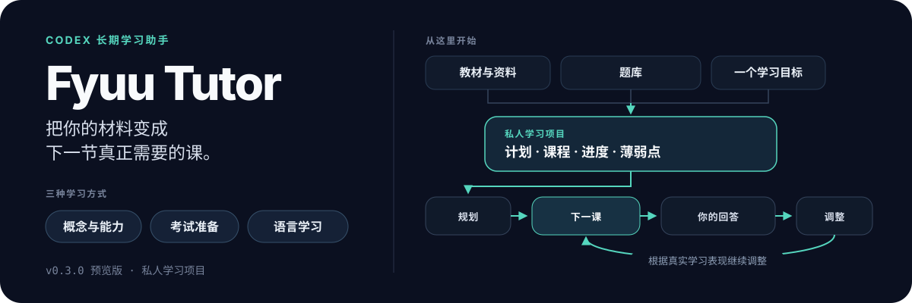

# Fyuu Tutor

[English](README.md) · 当前版本：**v0.3.0 — Rich Learning Experiences**

<p align="center">
  
</p>

把教材、题库或一个学习目标交给 Codex。它会帮你安排课程、制作每一课，并从上次停下的地方继续教。

Fyuu Tutor 适合需要持续几周或几个月的学习，而不是只问一次问题。

它会把课程、练习、学习进度和薄弱点保存在一个独立的学习项目里。换一个对话，甚至换一个 Agent，也可以从原来的进度继续。

## 它能帮你做什么

假设你手上有一本教材、几份 PDF、一套题库，或者只是一个“我想学会这个”的目标。

Fyuu Tutor 会做这些事：

- 先检查材料是否完整，PDF 转换有没有漏掉页面、表格或题目。
- 整理出需要学习的全部内容，避免课程只讲几个重难点，却漏掉基础部分。
- 根据你现在的水平，安排课程顺序。
- 生成可以直接在浏览器打开的 HTML 课程、练习和速查资料。
- 记录你已经学过什么、哪里容易错、哪些内容还需要复习。
- 根据你的回答决定下一步，而不是机械地按目录往下讲。

生成了一份课件，不代表你已经学会。Fyuu Tutor 会把“课件已经做好”“你已经看过”“你能独立完成”“过一段时间仍然会”分开记录。

## 三种常见用法

### 学懂一个概念或掌握一种能力

比如你想学习 AI Agent、系统设计、数据分析或写程序。

你可以把一个概念、几篇文章或一个真实项目交给它。它会先找出需要补的基础，再通过例子、练习和实际任务，逐步检查你能不能自己解释和应用。

```text
使用 $fyuu-tutor，帮我根据这些材料学习 AI Agent。
先看看我已经会什么，再给我学习计划和第一课。
```

### 准备一场考试

比如 PMP、语言考试或其他有明确考纲的认证。

Fyuu Tutor 会把考纲、教材、题目和课程对应起来，检查是否有内容被遗漏。它还会记录错题、判断错误原因，并把薄弱知识点放进后面的课程和复习题里。

```text
使用 $fyuu-tutor，根据这份考纲、教材和题库建立一个备考项目。
先检查材料和考纲覆盖情况，不要马上开始出题。
```

### 学一门语言

你可以交给它课本、对话、词汇表或工作场景。

它会从材料中整理词汇、表达和对话，制作听说读写练习，并要求你主动表达。仅仅看懂答案，不会被当成已经会说或会写。

```text
使用 $fyuu-tutor，根据这些商务对话建立一个英语口语项目。
每一课都要有真实场景、主动表达和对旧错误的复习。
```

## 一次学习是怎么进行的

1. 你告诉它想学什么，并提供已有材料。
2. 它检查材料、目标和你目前的基础。
3. 它整理完整的学习范围和课程顺序。
4. 它只制作当前最需要的一课。
5. 你学习、回答问题或完成练习。
6. 它记录你的表现和薄弱点，再决定下一课。

它不会一次生成几十节课，然后把你丢在一堆文件里。课程会随着你的实际表现继续调整。

## 它和普通 AI 对话有什么不同

| 普通 AI 对话 | Fyuu Tutor |
|---|---|
| 回答眼前的问题 | 管理一个可以长期继续的学习项目 |
| 主要依赖模型已有知识 | 优先根据你提供的材料和可信来源教学 |
| 解释完就默认可以继续 | 要看你能否独立回答、应用或表达 |
| 新对话容易丢失进度 | 进度、错误和下一步写在项目文件里 |
| 容易只讲有趣或困难的部分 | 先检查完整范围，再安排重点和基础 |
| 一个 Agent 知道发生了什么 | 其他 Agent 也能按照同一套记录继续 |

## 会生成什么

每个学习项目通常会包含：

- 一份学习目标和完整课程规划；
- 可以直接打开的 HTML 课程；
- 练习题、错题和学习记录；
- 适合复习的速查资料；
- 当前进度、薄弱点和明确的下一步；
- 使用教材时的来源记录和覆盖关系。

这些内容属于你的私人学习项目，不会被放进公开的 Fyuu Tutor 仓库。

## 安装

最简单的方法，是把下面这句话发给 Codex：

```text
请帮我安装 Fyuu Tutor：
https://github.com/fyuuwang/fyuu-tutor/tree/main/fyuu-tutor
```

也可以使用 Codex 自带的 Skill Installer：

```bash
python3 ~/.codex/skills/.system/skill-installer/scripts/install-skill-from-github.py \
  --repo fyuuwang/fyuu-tutor \
  --path fyuu-tutor
```

安装完成后，可以直接说：

```text
使用 $fyuu-tutor，根据我提供的材料建立一个学习项目。
先检查目标、材料和我目前的基础，再给我课程规划和第一步。
```

Fyuu Tutor 当前优先支持 Codex。确定性脚本需要 Python 3.11 或更高版本。OCR 等工具是可选项，不会自动安装。

## 这个项目从哪里来

Fyuu Tutor 最初基于 Matt Pocock 的 [`teach`](https://github.com/mattpocock/skills/tree/main/skills/productivity/teach) Skill。

`teach` 提供了几个很重要的起点：围绕真实目标教学、使用 HTML 制作课程、保存学习记录，并根据学习者当前水平选择下一课。

我把它实际用在了三类长期学习中：

- AI 和系统设计等概念、能力学习；
- PMP 认证备考；
- 粤语等语言学习。

真实使用以后，我补上了原版没有重点解决的部分：

- 教材、PDF 和题库的提取与多重校验；
- 考纲或教材内容与课程、题目的完整对应；
- 基础内容和重难点同时覆盖；
- 区分“课件做好了”和“学习者真的会了”；
- 根据具体错误安排后续课程和复习；
- 让不同 Agent 能安全地接手同一个学习项目；
- 把私人教材和学习记录与公开 Skill 完全分开。

其他 Tutor 项目也为产品研究提供了参考，但没有复制它们的代码或提示词。完整来源和许可证说明见
[`THIRD_PARTY_NOTICES.md`](fyuu-tutor/THIRD_PARTY_NOTICES.md)。

## 当前状态

Fyuu Tutor 目前是 `v0.3.0` 公开预览版。

它已经在三个长期学习项目中使用，但还需要更多不同用户、不同教材和不同学习目标的验证。预览阶段如果修改项目格式或使用方式，会在更新记录中附上迁移说明。

## License

MIT，详见 [LICENSE](LICENSE)。
